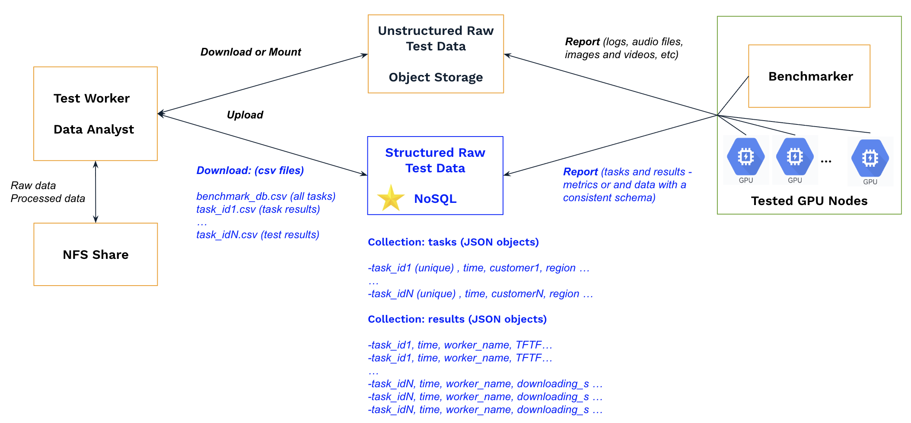

# Benchmarking DB

We will be conducting numerous tests and require a centralized solution to efficiently store and manage structured raw test results, such as metrics and other data with consistent schemas. Note that unstructured data—including log files, audio, images, and videos—are not included in this repository.



## Key Requirements

Each test includes metadata such as customer, date, use case (e.g., NCCL/RCCL, image generation, LLM), GPU type and count, region, and other relevant details. Centralizing this metadata would be valuable for future reference and analysis.

In addition, each test may generate a large volume of benchmark data—potentially millions of records. For example, in a batch transcription benchmarking test, processing each audio file can produce metrics such as audio duration, inference time, real-time factor, word count, and source and target locations. A single test transcribing millions of hours of audio may therefore generate millions of benchmark records.

A test may run on hundreds of GPU nodes, continuously generating multiple data points per second over a period ranging from a few hours to several days. Test data can be reported either through a central benchmarker or directly by the individual nodes.

Data within a test is usually consistent in structure (as JSON objects), but this is not required, and structures may differ across tests. For example, benchmarking different AI models produces different types of test data, and benchmarking the same model across heterogeneous environments with varying hardware configurations can also result in different data structures.

Individual test results can be retrieved by a unique test ID from millions of records and exported to CSV for analysis, without the need for complex queries or relationships.

## Solution

We use [the managed MongoDB](https://docs.digitalocean.com/products/databases/mongodb/getting-started/quickstart/) for the following reasons:

- Flexible Data Model: Supports JSON-like (BSON) documents, allowing each test to have a flexible data structure.

- Scalability: Efficiently handles millions of records.

- Fast Retrieval: Supports [indexes](https://www.mongodb.com/docs/languages/python/pymongo-driver/current/indexes/), enabling quick access by test ID or timestamp.

Assume we currently use a single database, `benchmark_db`. As the volume of data grows, it may become necessary to partition it across multiple databases, such as `benchmark_db_2026` or `benchmark_db_2026_customer_a`.

### Data Model

#### Tasks Collection

The tasks collection stores metadata for each test, including customer, date, use case, GPU type and count, and other relevant details. Here is an example of how to store a single document for a test:

``` yaml
{ 
  "task_id":      "20260101-cai-llm-test-1",                            
  "timestamp":    datetime.now(),                                
  "customer":     "cai",
  "sa":           "rshue",
  "model":        "meta-llama/Llama-3.1-70B-Instruct",
  "vllm_version": "rocm/vllm:rocm7.0.0_vllm_0.11.1_20251103",
  "node_count":   20,
  "node_type":    "mixed-MI325X-MI350X",
  "region":       "nyc2",
  "use_case":     "llm inference",
  "misc":         "" 
}
```

A unique index on `task_id` can ensure that each test has a distinct identifier. A single-field index on `timestamp` allows efficient sorting or filtering of tests by timestamp. While indexes could be created on other fields, the tasks collection is not expected to contain a large volume of data, so additional indexes are generally unnecessary.

``` Python
db = mongo_db_client["benchmark_db"]
tasks = db["tasks"]
tasks.create_index( [("task_id", 1) ], unique=True )
tasks.create_index( [("timestamp", 1) ] ) 
``` 

#### Results Collection 

The results collection stores individual JSON documents for each data point generated during a test. For example, a document for audio transcription might look like this:

``` yaml
{
  "task_id":          "20260101-cai-transcription-test-2",
  "timestamp":        "2026-01-01T12:00:00Z",
  "source_location":  "s3://rs_bucket/input/audio_001.wav",
  "audio_duration_s": 3600.0,
  "inference_time_s": 36.0,
  "real_time_factor": 100,
  "word_count":       7200,
  "target_location":  "s3://rs_bucket/artifact/audio_001.txt"
}
```

All results from a single test must share the same `task_id`. The compound index [("task_id", 1), ("timestamp", 1)] enables fast retrieval of all results for a specific task in chronological order and scales efficiently to millions of records per test.

``` Python
db = mongo_db_client["benchmark_db"]
results = db["results"]
results.create_index( [("task_id",1), ("timestamp",1)] ) 
``` 

## How to Use

Create a .env file in the root of the workspace and provide the credentials for accessing the managed MongoDB cluster:

```
# MongoDB credentials
MDB_USERNAME=doadmin
MDB_PASSWORD="***********************"

# MongoDB host (exclude the "mongodb+srv://" prefix)
MDB_HOST="***********************.mongo.ondigitalocean.com"

# Default admin database
MDB_DATABASE=admin

# Benchmark database
MDB_BENCHMARK_DB=benchmark_db

# Alternative for partitioned data
# MDB_BENCHMARK_DB=benchmark_db_2026
```

For first-time use, run the code to initialize the database and create the necessary indexes:

python3 [V1/mdb_purge.py](V1/mdb_purge.py)

Next, integrate the code with `Benchmarker` and `Data Analyst` for reporting and downloading test results.